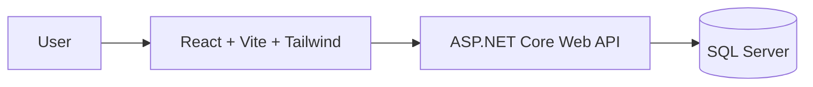

# Product CRUD — React + ASP.NET Core + SQL Server + Tailwind CSS

This project is a full-stack inventory management application built to demonstrate a working CRUD workflow across a modern React frontend, an ASP.NET Core Web API, and a SQL Server database. It is designed as a practical starter app for managing products, categories, and units in a clean, production-style structure.

The application supports:

- viewing products, categories, and units
- creating and editing records
- deleting records with confirmation
- tracking stock and pricing
- using a relational database for persistence
- running the full stack locally via Docker Compose

## Overview

The project is split into three main parts:

- Frontend: React + Vite + Tailwind CSS
- Backend: ASP.NET Core 8 Web API
- Database: SQL Server 2022

This gives a simple and realistic example of a full-stack architecture using a REST API and a modern single-page frontend.

## Tech stack

- ASP.NET Core 8
- Entity Framework Core
- SQL Server 2022
- React
- Vite
- Tailwind CSS
- Axios
- Docker + Docker Compose

## Features

- Product management with CRUD operations
- Category management
- Unit management
- Search and filtering
- Stock and pricing fields
- Seeded sample data
- REST API with validation
- Automatic EF Core migrations on startup
- Dockerized local development
- Toast notifications and confirmation dialogs

## Project structure

```text
product-crud-app/
├── backend/
│   └── ProductApi/
│       ├── Controllers/
│       ├── Data/
│       ├── DTOs/
│       ├── Migrations/
│       ├── Models/
│       ├── Properties/
│       ├── Program.cs
│       ├── appsettings.json
│       ├── appsettings.Development.json
│       ├── ProductApi.csproj
│       └── Dockerfile
├── frontend/
│   └── product-crud-client/
│       ├── src/
│       ├── package.json
│       ├── vite.config.js
│       ├── tailwind.config.js
│       └── Dockerfile
├── docker-compose.yml
├── .gitignore
├── .dockerignore
├── README.md
└── LICENSE
```

## Quick start with Docker Compose

The simplest way to run the project is from the root folder:

```bash
docker compose up --build
```

After startup:

- Frontend: http://localhost:5173
- Backend API: http://localhost:8080
- SQL Server: localhost:1433

This Compose setup runs:

- SQL Server database container
- ASP.NET Core backend container
- React frontend container

## Local development

### 1. Backend

Requirements:

- .NET 8 SDK
- SQL Server or Docker-backed SQL Server

```bash
cd backend/ProductApi
dotnet restore
dotnet run
```

The API will be available at:

- http://localhost:8080
- Swagger UI: http://localhost:8080/swagger

### 2. Database

The app expects a SQL Server database named `ProductCrudDb`.

If you want to start SQL Server manually:

```bash
docker run -e "ACCEPT_EULA=Y" -e "MSSQL_SA_PASSWORD=YourStrong@Passw0rd" \
  -p 1433:1433 --name sql-server -d mcr.microsoft.com/mssql/server:2022-latest
```

### 3. Frontend

Requirements:

- Node.js 18+

```bash
cd frontend/product-crud-client
npm install
npm run dev
```

Then open:

- http://localhost:5173

## API endpoints

### Products

| Method | Route              | Description          |
| ------ | ------------------ | -------------------- |
| GET    | /api/products      | Get all products     |
| GET    | /api/products/{id} | Get a single product |
| POST   | /api/products      | Create a product     |
| PUT    | /api/products/{id} | Update a product     |
| DELETE | /api/products/{id} | Delete a product     |

### Categories

| Method | Route                | Description        |
| ------ | -------------------- | ------------------ |
| GET    | /api/categories      | Get all categories |
| GET    | /api/categories/{id} | Get a category     |
| POST   | /api/categories      | Create a category  |
| PUT    | /api/categories/{id} | Update a category  |
| DELETE | /api/categories/{id} | Delete a category  |

### Units

| Method | Route           | Description   |
| ------ | --------------- | ------------- |
| GET    | /api/units      | Get all units |
| GET    | /api/units/{id} | Get a unit    |
| POST   | /api/units      | Create a unit |
| PUT    | /api/units/{id} | Update a unit |
| DELETE | /api/units/{id} | Delete a unit |

## Data model

The application includes the following main entities:

- Product
- Category
- Unit

Each product contains the following key information:

- product code
- name and description
- category relationship
- unit relationship
- purchase price
- selling price
- opening stock
- minimum stock level
- active status
- created and updated timestamps

## Architecture



## Notes

- CORS is enabled for the frontend running on localhost ports 5173 and 3000.
- EF Core automatically applies pending migrations at startup.
- Sample master data for categories and units is seeded into the database.
- The app is designed for local development and demo use, but it can also be extended into a real inventory or catalog solution.

## GitHub project description

Product CRUD is a full-stack inventory management application built with React, ASP.NET Core, SQL Server, and Tailwind CSS. It allows users to manage products, categories, and units through a clean interface and a reliable REST API. The app is designed as a simple but realistic business application, with stock, pricing, and catalog management features built in.

It includes a Docker Compose setup for running the database, API, and frontend together locally, making it easy to demo, test, and extend.
