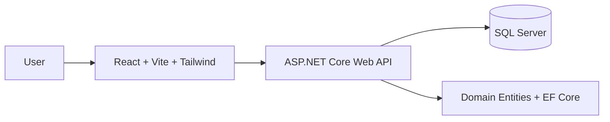

# Product CRUD Inventory Management System

This project is a full-stack inventory management application built with React, ASP.NET Core, and SQL Server. It is designed for managing products, categories, units, suppliers, and stock movement activity in a clean, operational workflow.

The application includes:

- product catalog management with CRUD operations
- category, unit, and supplier setup
- stock movement tracking
- low-stock alerts and reorder suggestions
- inventory dashboard analytics
- seeded master data and EF Core migrations
- Docker-based local development setup

## Overview

The solution is split into:

- Frontend: React + Vite + Tailwind CSS
- Backend: ASP.NET Core Web API
- Database: SQL Server 2022
- Domain model: .NET entity classes and EF Core configuration

This gives a practical full-stack example of a business inventory application with a REST API, relational database, and modern UI.

## Tech stack

- ASP.NET Core Web API
- .NET 10
- Entity Framework Core
- SQL Server 2022
- React 18
- Vite
- Tailwind CSS
- Axios
- Docker Compose

## Features

### Inventory operations

- Create, edit, and delete products
- Manage categories, units, and suppliers
- Search and filter product records
- Track stock movements and inventory history
- View product-level stock and minimum stock thresholds

### Inventory monitoring

- Dashboard landing page with key operational metrics
- Low-stock alerts and warnings
- Automatic reorder suggestions based on minimum stock
- Stock movement analytics summary
- Supplier and category insight overview

### Data management

- Seeded catalog data for categories and units
- Database migrations managed through EF Core
- Automatic migration application at startup in development
- Validation and confirmation dialogs in the UI
- Toast notifications for user feedback

## Project structure

```text
product-crud-app/
├── backend/
│   ├── InventoryManagementSystem.Domain/
│   │   ├── Entities/
│   │   │   ├── Category.cs
│   │   │   ├── Product.cs
│   │   │   ├── StockMovement.cs
│   │   │   ├── Supplier.cs
│   │   │   └── Unit.cs
│   │   └── InventoryManagementSystem.Domain.csproj
│   └── ProductApi/
│       ├── Controllers/
│       │   ├── CategoriesController.cs
│       │   ├── ProductsController.cs
│       │   ├── StockMovementsController.cs
│       │   ├── SuppliersController.cs
│       │   └── UnitsController.cs
│       ├── Data/
│       │   └── ApplicationDbContext.cs
│       ├── DTOs/
│       │   ├── CategoryDto.cs
│       │   ├── ProductDto.cs
│       │   ├── StockMovementDto.cs
│       │   ├── SupplierDto.cs
│       │   └── UnitDto.cs
│       ├── Migrations/
│       │   ├── 20260912155317_InitialCreate.cs
│       │   ├── 20260912155317_InitialCreate.Designer.cs
│       │   ├── 20260912164054_AddInventorySupport.cs
│       │   ├── 20260912164054_AddInventorySupport.Designer.cs
│       │   ├── 20260913150229_AddMoreUnits.cs
│       │   ├── 20260913150229_AddMoreUnits.Designer.cs
│       │   └── ApplicationDbContextModelSnapshot.cs
│       ├── Properties/
│       │   └── launchSettings.json
│       ├── Program.cs
│       ├── appsettings.json
│       ├── appsettings.Development.json
│       ├── ProductApi.csproj
│       └── Dockerfile
├── frontend/
│   └── product-crud-client/
│       ├── src/
│       │   ├── components/
│       │   │   ├── CategoryForm.jsx
│       │   │   ├── CategoryTable.jsx
│       │   │   ├── ConfirmDialog.jsx
│       │   │   ├── ProductForm.jsx
│       │   │   ├── ProductTable.jsx
│       │   │   ├── StockMovementForm.jsx
│       │   │   ├── StockMovementTable.jsx
│       │   │   ├── SupplierForm.jsx
│       │   │   ├── SupplierTable.jsx
│       │   │   ├── Toast.jsx
│       │   │   ├── UnitForm.jsx
│       │   │   └── UnitTable.jsx
│       │   ├── pages/
│       │   │   ├── CategoriesPage.jsx
│       │   │   ├── DashboardPage.jsx
│       │   │   ├── ProductsPage.jsx
│       │   │   ├── StockMovementsPage.jsx
│       │   │   ├── SuppliersPage.jsx
│       │   │   └── UnitsPage.jsx
│       │   ├── services/
│       │   │   ├── inventoryService.js
│       │   │   └── productService.js
│       │   ├── App.jsx
│       │   ├── index.css
│       │   └── main.jsx
│       ├── index.html
│       ├── package.json
│       ├── postcss.config.js
│       ├── tailwind.config.js
│       ├── vite.config.js
│       └── Dockerfile
├── docker-compose.yml
├── .gitignore
├── .dockerignore
├── README.md
├── LICENSE
└── .vscode/
```

## Quick start with Docker Compose

From the root folder, run:

```bash
docker compose up --build
```

The app will start with:

- Frontend: http://localhost:5173
- Backend API: http://localhost:8080
- Swagger: http://localhost:8080/swagger
- SQL Server: localhost:1433

This compose setup runs the database, API, and UI together in one local workflow.

## Local development

### 1. Backend

Requirements:

- .NET 10 SDK
- SQL Server running locally or via Docker

```bash
cd backend/ProductApi
dotnet restore
dotnet run
```

The API is configured to automatically apply pending EF Core migrations on startup.

### 2. Database

The application uses the default connection string in appsettings.json:

```json
"DefaultConnection": "Server=localhost,1433;Database=ProductCrudDb;User Id=sa;Password=YourStrong@Passw0rd;TrustServerCertificate=True;MultipleActiveResultSets=true"
```

If you want to run SQL Server manually:

```bash
docker run -e "ACCEPT_EULA=Y" -e "MSSQL_SA_PASSWORD=YourStrong@Passw0rd" \
  -p 1433:1433 --name sql-server -d mcr.microsoft.com/mssql/server:2022-latest
```

### 3. Frontend

Requirements:

- Node.js 18+

```bash
cd frontend/product-crud-client
npm install
npm run dev
```

Then open:

- http://localhost:5173

## Main API endpoints

### Products

| Method | Route              | Description          |
| ------ | ------------------ | -------------------- |
| GET    | /api/products      | Get all products     |
| GET    | /api/products/{id} | Get a single product |
| POST   | /api/products      | Create a product     |
| PUT    | /api/products/{id} | Update a product     |
| DELETE | /api/products/{id} | Delete a product     |

### Categories

| Method | Route                | Description        |
| ------ | -------------------- | ------------------ |
| GET    | /api/categories      | Get all categories |
| GET    | /api/categories/{id} | Get a category     |
| POST   | /api/categories      | Create a category  |
| PUT    | /api/categories/{id} | Update a category  |
| DELETE | /api/categories/{id} | Delete a category  |

### Units

| Method | Route           | Description   |
| ------ | --------------- | ------------- |
| GET    | /api/units      | Get all units |
| GET    | /api/units/{id} | Get a unit    |
| POST   | /api/units      | Create a unit |
| PUT    | /api/units/{id} | Update a unit |
| DELETE | /api/units/{id} | Delete a unit |

### Suppliers

| Method | Route               | Description       |
| ------ | ------------------- | ----------------- |
| GET    | /api/suppliers      | Get all suppliers |
| GET    | /api/suppliers/{id} | Get a supplier    |
| POST   | /api/suppliers      | Create a supplier |
| PUT    | /api/suppliers/{id} | Update a supplier |
| DELETE | /api/suppliers/{id} | Delete a supplier |

### Stock movements

| Method | Route                    | Description             |
| ------ | ------------------------ | ----------------------- |
| GET    | /api/stockmovements      | Get all stock movements |
| GET    | /api/stockmovements/{id} | Get a stock movement    |
| POST   | /api/stockmovements      | Create a stock movement |

## Data model

The main application entities are:

- Product
- Category
- Unit
- Supplier
- StockMovement

Each product includes fields such as:

- product code
- name and description
- category relationship
- unit relationship
- supplier relationship
- purchase price
- selling price
- opening stock
- minimum stock level
- active flag
- timestamps for creation and update

## Dashboard and inventory features

The application includes a dedicated dashboard for operations and monitoring. It currently provides:

- total products and category counts
- low-stock totals
- reorder suggestions
- stock movement summary analytics
- inventory health overview

The dashboard is designed to surface operational issues quickly and help with replenishment decisions.

## Architecture



## Database and migrations

Entity Framework Core is used for persistence and schema management. The project includes migration files under the backend ProductApi Migrations folder.

Common commands:

```bash
cd backend/ProductApi
dotnet ef migrations add <MigrationName>
dotnet ef database update
```

## Notes

- CORS is configured for the local React dev server and Docker ports.
- EF Core migrations are applied automatically during startup in development.
- The project includes seeded category and unit data for quick demo usage.
- The app is intended for local development, demos, and extension into a larger business inventory system.

## GitHub project summary

Product CRUD Inventory Management System is a full-stack inventory application for tracking products, stock flow, and supplier operations. It pairs a modern React interface with an ASP.NET Core API and SQL Server database, providing a practical example of a business-facing inventory dashboard and management workflow.

It includes stock monitoring, low-stock alerts, reorder suggestions, and analytics so it can function beyond a simple CRUD demo and behave more like a real operations tool.
