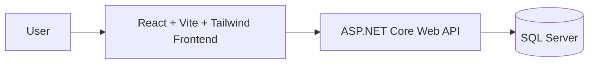

# Product CRUD — React + ASP.NET Core + SQL Server + Tailwind CSS

This project is a full-stack inventory management app built to demonstrate a working CRUD flow using modern web and backend tooling. It includes a React frontend, an ASP.NET Core Web API, and a SQL Server database, all connected in a simple developer-friendly setup.

The app is designed around a product catalog where users can:

- view all products
- create new products
- update product details
- delete products
- manage stock and pricing information

## Project overview

The app is split into two main parts:

- Backend: ASP.NET Core 8 Web API with Entity Framework Core and SQL Server
- Frontend: React + Vite + Tailwind CSS + Axios

This makes it a good example of a practical full-stack architecture using a traditional API and a modern UI layer.

### Tech stack

- ASP.NET Core 8 Web API
- Entity Framework Core
- SQL Server 2022
- React
- Vite
- Tailwind CSS
- Docker + Docker Compose

## Features

- Product listing screen
- Create product form
- Edit product flow
- Delete confirmation dialog
- Toast notifications
- REST API with CRUD endpoints
- SQL-backed persistence with automatic migrations
- Dockerized local development setup

## Project structure

```text
product-crud-app/
├── backend/
│   └── ProductApi/
│       ├── Controllers/
│       ├── Data/
│       ├── DTOs/
│       ├── Migrations/
│       ├── Models/
│       ├── Properties/
│       ├── Program.cs
│       ├── appsettings.json
│       ├── appsettings.Development.json
│       ├── ProductApi.csproj
│       └── Dockerfile
├── frontend/
│   └── product-crud-client/
│       ├── src/
│       ├── package.json
│       ├── vite.config.js
│       ├── tailwind.config.js
│       └── Dockerfile
├── docker-compose.yml
├── .gitignore
├── .dockerignore
├── README.md
└── .env.example (optional, if used later)
```

## Quick start with Docker Compose

This is the easiest way to run the entire project locally.

From the project root:

```bash
docker compose up --build
```

After startup:

- Frontend: http://localhost:5173
- Backend API: http://localhost:8080/api/products
- SQL Server: localhost:1433

The Compose file starts:

- SQL Server container
- ASP.NET Core backend container
- React frontend container

## Manual setup

### 1. Backend setup

**Requirements:** .NET 8 SDK, SQL Server (local, Docker, or Azure SQL), EF Core CLI tools.

```bash
cd backend/ProductApi

dotnet restore

dotnet tool install --global dotnet-ef

# Optional: verify/update the connection string if needed
# "DefaultConnection": "Server=localhost,1433;Database=ProductCrudDb;User Id=sa;Password=YourStrong@Passw0rd;TrustServerCertificate=True;"

# Create migrations if needed
dotnet ef migrations add InitialCreate

# Run the API
dotnet run
```

In this environment, the app was verified on:

- https://127.0.0.1:7080
- http://127.0.0.1:8080

The default ASP.NET ports may be blocked in some local environments, so if the backend does not start on the default ports, check `Properties/launchSettings.json` and update the frontend `API_BASE_URL` to match.

Swagger UI is available at `/swagger` in development.

### 2. Database setup

If you do not have SQL Server installed locally, run it with Docker:

```bash
docker run -e "ACCEPT_EULA=Y" -e "MSSQL_SA_PASSWORD=YourStrong@Passw0rd" \
  -p 1433:1433 --name sql-server -d mcr.microsoft.com/mssql/server:2022-latest
```

This container exposes SQL Server on port `1433` and is used by the API connection string.

### 3. Frontend setup

**Requirements:** Node.js 18+

```bash
cd frontend/product-crud-client
npm install
npm run dev
```

Open:

- http://localhost:5173

Before running, confirm `API_BASE_URL` in `src/services/productService.js` matches the backend port you started. In this project, that value is:

```js
https://127.0.0.1:7080/api/products
```

## API endpoints

| Method | Route              | Description          |
| ------ | ------------------ | -------------------- |
| GET    | /api/products      | List all products    |
| GET    | /api/products/{id} | Get one product      |
| POST   | /api/products      | Create a new product |
| PUT    | /api/products/{id} | Update a product     |
| DELETE | /api/products/{id} | Delete a product     |

## Architecture



This architecture demonstrates a common modern web stack where the frontend communicates with a REST API, and the API persists data in a relational database.

## Notes

- CORS is configured in `Program.cs` to allow requests from the React app running on `http://localhost:5173` and `http://localhost:3000`.
- The database is seeded with sample products via EF Core `HasData` in `ApplicationDbContext.cs`.
- When the application starts, pending migrations are applied automatically.
- To reset the database, remove it and re-run the migration or application startup.
- This project is intentionally straightforward and suitable as a learning project, demo app, or base for a product catalog application.

## Why this project is useful

This repository demonstrates a realistic, full-stack development workflow:

- backend API design
- database-driven persistence
- frontend state and form handling
- CRUD patterns
- API integration with Axios
- local development using Docker and standard .NET tooling

It is a practical starting point for building a larger business app with inventory, catalog, or sales features.

## GitHub project description

Product CRUD is a full-stack inventory management app built with React, ASP.NET Core Web API, SQL Server, and Tailwind CSS. It provides a complete CRUD experience for managing products, including create, read, update, delete, pricing, stock tracking, and a clean UI for inventory operations.

The project includes a Docker Compose setup for running the database, API, and frontend together locally, making it easy to demo or extend for real-world product catalog scenarios.
