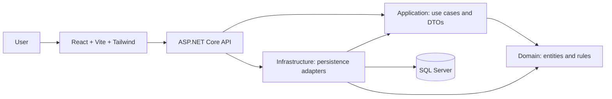

# Product CRUD Inventory Management System

This project is a full-stack inventory management application built with React, ASP.NET Core, and SQL Server. It provides product, category, unit, supplier, and stock-movement management, along with inventory monitoring and JWT-based account registration and login.

The application includes:

- product catalog management with CRUD operations
- category, unit, and supplier setup
- stock movement tracking
- low-stock alerts and reorder suggestions
- inventory dashboard analytics
- ASP.NET Core Identity registration, login, and role assignment
- EF Core migrations applied at API startup
- Docker-based local development setup

## Overview

The solution is split into:

- Frontend: React + Vite + Tailwind CSS
- Backend: ASP.NET Core Web API
- Database: SQL Server 2022
- Domain model: .NET entity classes and EF Core configuration

This gives a practical full-stack example of a business inventory application with a REST API, relational database, and modern UI.

## Tech stack

- ASP.NET Core Web API
- .NET 10
- Entity Framework Core
- SQL Server 2022
- React 19
- Vite 8
- Tailwind CSS
- Axios
- React Router
- ASP.NET Core Identity and JWT bearer authentication
- Docker Compose

## Features

### Inventory operations

- Create, edit, and delete products
- Manage categories, units, and suppliers
- Search and filter product records
- Track stock movements and inventory history
- View product-level stock and minimum stock thresholds

### Inventory monitoring

- Dashboard landing page with key operational metrics
- Low-stock alerts and warnings
- Automatic reorder suggestions based on minimum stock
- Stock movement analytics summary
- Supplier and category insight overview

### Data management

- Identity roles seeded at API startup: Admin, Manager, Staff, and Viewer
- Database migrations managed through EF Core
- Automatic migration application at API startup
- Validation and confirmation dialogs in the UI
- Toast notifications for user feedback

### Authentication

- Registration with first name, last name, mobile number, email, and password
- Login using email and password
- New accounts are assigned the Staff role by default
- Access JWT persisted by the frontend and attached to API requests as a bearer token
- Logout clears the locally stored session

## Project structure

The backend is divided into four .NET projects. The Domain project contains the core inventory entities; Application defines service contracts, DTOs, and use-case services; Infrastructure implements repositories and SQL Server persistence; and Api hosts the HTTP endpoints and configures the application. The frontend separates route-level screens, reusable UI components, and API service modules.

```text
product-crud-app/
├── backend/
│   ├── NFJ.InventoryManagementSystem.Api/
│   │   ├── Controllers/                               # Auth, products, categories, units, suppliers, stock
│   │   ├── Properties/launchSettings.json             # Local HTTP/HTTPS profiles
│   │   ├── Program.cs                                  # DI, API versioning, JWT, CORS, Swagger, middleware
│   │   ├── appsettings*.json                           # Local configuration
│   │   └── Dockerfile                                  # API container build
│   ├── NFJ.InventoryManagementSystem.Application/
│   │   ├── Common/
│   │   │   ├── Exceptions/                            # Application-level exceptions
│   │   │   ├── Identity/                               # AppUser identity extension
│   │   │   └── Interfaces/                             # Repository and Unit of Work contracts
│   │   ├── DTOs/                                       # API/service request and response contracts
│   │   ├── Mapping/                                    # Inventory response mapping
│   │   └── Services/                                   # Inventory and authentication use cases
│   ├── NFJ.InventoryManagementSystem.Domain/
│   │   └── Entities/                                   # Product, category, unit, supplier, stock movement
│   ├── NFJ.InventoryManagementSystem.Infrastructure/
│   │   ├── Persistence/
│   │   │   ├── Context/                                # EF Core context and Unit of Work
│   │   │   └── Migrations/                             # Database schema history and model snapshot
│   │   ├── Repositories/                               # EF Core repository implementations
│   │   └── DependencyInjection.cs                      # Infrastructure and Identity registration
│   └── NFJ.InventoryManagementSystem.slnx              # .NET solution
├── frontend/
│   └── product-crud-client/
│       ├── src/
│       │   ├── components/                             # Forms, tables, dialogs, charts, notifications
│       │   ├── pages/                                  # Dashboard, inventory pages, login, registration
│       │   ├── services/                               # Axios clients and resource/auth API calls
│       │   ├── App.jsx                                 # Application shell, navigation, auth state
│       │   ├── main.jsx                                # React entry point and router setup
│       │   └── index.css                               # Tailwind layers and global styles
│       ├── package.json                                # Frontend scripts and dependencies
│       ├── vite.config.js                              # Vite host and port configuration
│       └── tailwind.config.js                           # Tailwind theme and content paths
├── docker-compose.yml
├── .gitignore
├── README.md
└── package-lock.json                                   # Root lockfile
```

### Layer responsibilities

- **API:** Handles HTTP routing, API versioning, Swagger, CORS, authentication middleware, and dependency composition. Controllers translate HTTP requests into Application service calls.
- **Application:** Holds business workflows and service contracts, request/response DTOs, identity-aware account services, and repository abstractions. It coordinates operations without owning EF Core persistence.
- **Domain:** Defines inventory entities and domain state. It does not depend on the API or Infrastructure projects.
- **Infrastructure:** Implements persistence using EF Core and SQL Server, provides repositories and Identity stores, and owns database migrations.
- **Frontend:** `pages/` compose user workflows, `components/` provide reusable UI, and `services/` call the backend API. `App.jsx` owns navigation and the current client-side authentication session.
- **Docker Compose:** Runs SQL Server, the API container, and the Vite development server for local full-stack development.

## Prerequisites

For the Docker workflow, install Docker Desktop with Docker Compose support.

For local development without a containerized frontend/backend, install:

- .NET 10 SDK
- Node.js `^20.19.0` or `>=22.12.0`, plus npm
- Docker Desktop or SQL Server 2022 (the default connection expects SQL Server on `localhost:1433`)

## Quick start with Docker Compose

From the root folder, run:

```bash
docker compose up --build
```

The Compose configuration starts SQL Server, the API, and the Vite development server. Once the services are healthy, open:

- Frontend: http://localhost:5173
- Backend API: http://localhost:9000/api/v1
- Swagger UI: http://localhost:9000/swagger
- SQL Server: `localhost:1433`

The API applies pending EF Core migrations and seeds the Identity roles when it starts. Register an account through the UI to begin. To stop the services, run `docker compose down` from the repository root.

The SQL Server service does not currently declare a persistent Docker volume. Treat this Compose database as disposable; recreating its container can remove its local data. Back up any data you need before removing containers.

### Rebuild the API after backend changes

The backend runs from a Docker image. After changing backend source code, rebuild and restart the service so the container uses the new code:

```bash
docker compose up -d --build backend
```

## Local development

The Docker workflow above is the simplest way to run the full stack. To run the API and frontend as local processes while keeping SQL Server in Docker:

1. Start SQL Server:

```bash
docker compose up -d sql-server
```

2. Start the API from the repository root. The `http` launch profile listens on `http://127.0.0.1:8080`:

```bash
dotnet run --project backend/NFJ.InventoryManagementSystem.Api/NFJ.InventoryManagementSystem.Api.csproj --launch-profile http
```

3. In a second terminal, configure the frontend to use that local API, install dependencies, and start Vite:

PowerShell:

```powershell
cd frontend/product-crud-client
$env:VITE_API_BASE_URL = "http://localhost:8080/api"
npm install
npm run dev
```

Bash:

```bash
cd frontend/product-crud-client
VITE_API_BASE_URL=http://localhost:8080/api npm run dev
```

Vite uses port `5173` and is configured to fail if the port is already occupied. The frontend's API default is `http://localhost:9000/api`, which is appropriate when using the Compose API.

4. Open http://localhost:5173. The API's Swagger UI is available at http://127.0.0.1:8080/swagger when running with the Development environment.

### Frontend build

From `frontend/product-crud-client`:

```bash
npm install
npm run build
```

Vite writes the production build to `frontend/product-crud-client/dist`.

## Authentication and authorization

The API uses ASP.NET Core Identity for accounts and roles, and signs JWT bearer access tokens for successful registration and login. The frontend stores the returned access token in `localStorage` and sends it as `Authorization: Bearer <token>` on its API requests.

Authentication endpoints are available with and without the `/v1` segment:

| Method | Route                   | Access        | Description                                  |
| ------ | ----------------------- | ------------- | -------------------------------------------- |
| POST   | `/api/v1/auth/register` | Anonymous     | Create an account and return an access token |
| POST   | `/api/v1/auth/login`    | Anonymous     | Sign in and return an access token           |
| GET    | `/api/v1/auth/me`       | Authenticated | Return the current user's identity and roles |

Example registration request:

```json
{
  "firstName": "Jane",
  "lastName": "Doe",
  "phoneNumber": "+1 555 123 4567",
  "email": "jane@example.com",
  "password": "ExamplePass123"
}
```

Passwords must be at least eight characters and contain uppercase, lowercase, and numeric characters. Non-alphanumeric characters are not required. Email addresses must be unique. New accounts receive the `Staff` role by default; the API seeds the `Admin`, `Manager`, `Staff`, and `Viewer` roles.

**Authorization status:** the `/me` endpoint requires a valid access token. The inventory CRUD controllers do not currently have `[Authorize]` attributes, so their routes are not protected by authentication or role policies yet. Hiding UI actions based on a role is not a security boundary; enforce permissions in the API before exposing this app to untrusted users.

Refresh tokens are not implemented. When an access token expires, the user must sign in again. The development JWT signing key in `appsettings.json` is not suitable for production; provide a unique secret through secure deployment configuration and never commit production credentials. The current browser storage uses `localStorage`, which is accessible to JavaScript; review the token storage design and XSS protections before production use.

## Main API endpoints

All resource routes support both versioned paths such as `/api/v1/products` and unversioned compatibility paths such as `/api/products`. The examples below use the versioned routes.

### Products

| Method | Route                 | Description          |
| ------ | --------------------- | -------------------- |
| GET    | /api/v1/products      | Get all products     |
| GET    | /api/v1/products/{id} | Get a single product |
| POST   | /api/v1/products      | Create a product     |
| PUT    | /api/v1/products/{id} | Update a product     |
| DELETE | /api/v1/products/{id} | Delete a product     |

### Categories

| Method | Route                   | Description        |
| ------ | ----------------------- | ------------------ |
| GET    | /api/v1/categories      | Get all categories |
| GET    | /api/v1/categories/{id} | Get a category     |
| POST   | /api/v1/categories      | Create a category  |
| PUT    | /api/v1/categories/{id} | Update a category  |
| DELETE | /api/v1/categories/{id} | Delete a category  |

### Units

| Method | Route              | Description   |
| ------ | ------------------ | ------------- |
| GET    | /api/v1/units      | Get all units |
| GET    | /api/v1/units/{id} | Get a unit    |
| POST   | /api/v1/units      | Create a unit |
| PUT    | /api/v1/units/{id} | Update a unit |
| DELETE | /api/v1/units/{id} | Delete a unit |

### Suppliers

| Method | Route                  | Description       |
| ------ | ---------------------- | ----------------- |
| GET    | /api/v1/suppliers      | Get all suppliers |
| GET    | /api/v1/suppliers/{id} | Get a supplier    |
| POST   | /api/v1/suppliers      | Create a supplier |
| PUT    | /api/v1/suppliers/{id} | Update a supplier |
| DELETE | /api/v1/suppliers/{id} | Delete a supplier |

### Stock movements

| Method | Route                                      | Description                 |
| ------ | ------------------------------------------ | --------------------------- |
| GET    | /api/v1/stockmovements                     | Get all stock movements     |
| GET    | /api/v1/stockmovements/product/{productId} | Get movements for a product |
| POST   | /api/v1/stockmovements                     | Create a stock movement     |

## Data model

The main application entities are:

- Product
- Category
- Unit
- Supplier
- StockMovement
- ASP.NET Core Identity users, roles, and account metadata

Each product includes fields such as:

- product code
- name and description
- category relationship
- unit relationship
- supplier relationship
- purchase price
- selling price
- opening stock
- minimum stock level
- active flag
- timestamps for creation and update

## Dashboard and inventory features

The application includes a dedicated dashboard for operations and monitoring. It currently provides:

- total products and category counts
- low-stock totals
- reorder suggestions
- stock movement summary analytics
- inventory health overview

The dashboard is designed to surface operational issues quickly and help with replenishment decisions.

## Architecture


```mermaid
flowchart LR
    User[User] --> Frontend[React + Vite + Tailwind]
  Frontend --> API[ASP.NET Core API]
  API --> Application[Application: use cases and DTOs]
  API --> Infrastructure[Infrastructure: persistence adapters]
  Application --> Domain[Domain: entities and rules]
  Infrastructure --> Application
  Infrastructure --> Domain
  Infrastructure --> DB[(SQL Server)]
```

## Database and migrations

Entity Framework Core and SQL Server are owned by the Infrastructure project. Migrations are stored in `backend/NFJ.InventoryManagementSystem.Infrastructure/Persistence/Migrations`; the API applies pending migrations at startup.

Common commands:

```bash
dotnet tool install --global dotnet-ef

dotnet ef migrations add <MigrationName> \
  --project backend/NFJ.InventoryManagementSystem.Infrastructure/NFJ.InventoryManagementSystem.Infrastructure.csproj \
  --startup-project backend/NFJ.InventoryManagementSystem.Api/NFJ.InventoryManagementSystem.Api.csproj \
  --output-dir Persistence/Migrations

dotnet ef database update \
  --project backend/NFJ.InventoryManagementSystem.Infrastructure/NFJ.InventoryManagementSystem.Infrastructure.csproj \
  --startup-project backend/NFJ.InventoryManagementSystem.Api/NFJ.InventoryManagementSystem.Api.csproj
```

Run these commands from the repository root. Install the `dotnet-ef` tool only if it is not already available. The default development connection string targets SQL Server at `localhost:1433`; override `ConnectionStrings__DefaultConnection` for a different database. The API applies migrations automatically when it starts, so a separate `database update` is generally unnecessary for a running development instance.

## Troubleshooting

- **Frontend says the API cannot be reached:** verify that the API is running and that `VITE_API_BASE_URL` points to it. Compose uses `http://localhost:9000/api`; a locally launched API uses `http://localhost:8080/api` by default.
- **Port 5173 is already in use:** stop the process using that port. Vite has `strictPort` enabled and will not silently choose another port.
- **Backend changes do not appear in Docker:** rebuild the API image with `docker compose up -d --build backend`, then inspect startup output with `docker compose logs -f backend`.
- **API fails during startup or migrations:** check that SQL Server is healthy with `docker compose ps` and inspect database/API logs with `docker compose logs sql-server backend`.
- **Registration fails:** confirm the email is unused and the password meets the minimum length and character requirements. The registration form requires a mobile number.
- **401 from an authenticated endpoint:** sign in again to obtain a current access token. Refresh-token renewal is not currently supported.

## Notes

- CORS is configured for the local React dev server and Docker ports.
- EF Core migrations are applied automatically during API startup.
- Identity roles are created at startup; user accounts are created through registration.
- The default database credentials and JWT signing key are for local development only.
- The app is intended for local development and demos; complete API authorization and production credential hardening before deployment.
